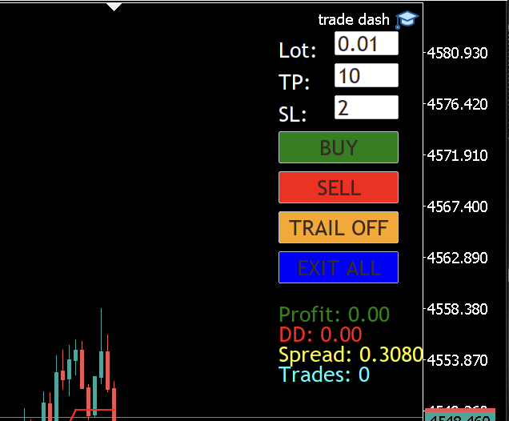
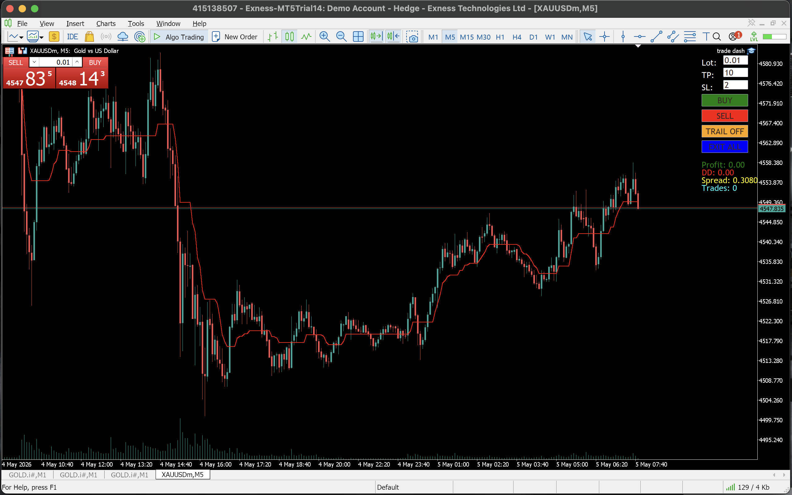

# TradeDash MT5 EA

TradeDash MT5 EA is an on-chart MetaTrader 5 Expert Advisor dashboard for fast manual order entry, direct price stop-loss/take-profit placement, trailing stop control, exit-all handling, and live account stats.

## Features

- Buy and sell buttons directly on the chart
- Editable lot size, TP, and SL fields
- Direct price-distance SL/TP calculation from the current chart price
- Toggleable trailing stop using the SL field as the trailing distance
- Exit-all button for open positions
- Live profit, drawdown, spread, and trade-count labels
- Responsive panel positioning on chart resize

## Screenshots

## Installation

1. Open MetaTrader 5.
2. Go to `File > Open Data Folder`.
3. Copy `Experts/TradeDashAdvancedDashboardEA.mq5` into `MQL5/Experts/`.
4. Open MetaEditor and compile the EA.
5. Attach `TradeDashAdvancedDashboardEA` to a chart.
6. Enable Algo Trading before placing orders.

## Inputs

The dashboard fields are edited directly on the chart:

- `Lot`: order volume
- `TP`: take-profit distance from entry price
- `SL`: stop-loss distance from entry price and trailing-stop distance when trailing is enabled

## Notes

This EA places manual dashboard trades. Test on a demo account first and confirm symbol contract specifications, broker stop levels, and spread behavior before using it with real capital.

## Suggested Repository Name

`tradedash-mt5-ea`
